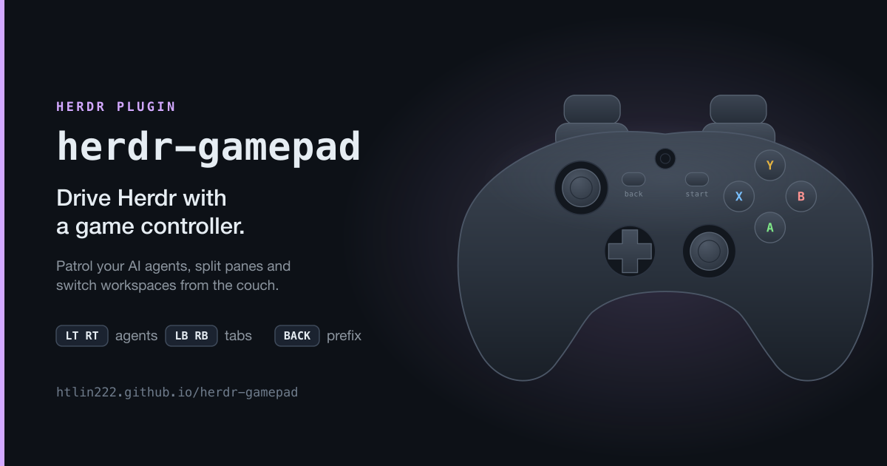
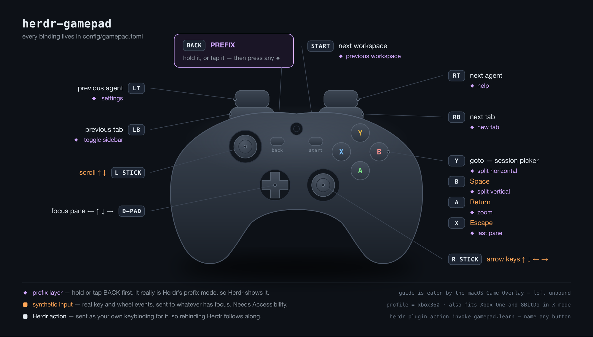

<p align="center">
  
</p>

<h1 align="center">herdr-gamepad</h1>

<p align="center">
  Drive <a href="https://herdr.dev">Herdr</a> with a game controller. Patrol your AI agents,
  split panes, and switch workspaces from the couch — any gamepad, mapped by you in 60 seconds.
</p>

<p align="center">
  <a href="https://htlin222.github.io/herdr-gamepad/"><b>Open the configurator</b></a> —
  plug a pad in, press buttons, pick actions from a dropdown, copy the generated
  <code>gamepad.toml</code>.
</p>

---

## This fork

[yang3kc/herdr-gamepad](https://github.com/yang3kc/herdr-gamepad) tracks
[htlin222/herdr-gamepad](https://github.com/htlin222/herdr-gamepad) and adds what a
Bluetooth Xbox Series X|S pad needs to be fully usable:

- **D-pad.** A HID hat switch is decoded into `dpad_up` / `dpad_down` / `dpad_left` /
  `dpad_right` by the reader itself. No profile entry; diagonals press two.
- **Triggers on the Simulation page.** `[profile.axes]` accepts `Brake = "lt"` and
  `Accelerator = "rt"`, which is where Bluetooth Xbox Series pads report LT and RT.
- **Share button** (Consumer page, usage 0xB2). A new standard name `share`; map it with
  `[profile.buttons] 178 = "share"`.
- **`"$focused"` works.** `pane.current` nests the id under `pane`; the substitution now
  reads it from there, so every `[[bind]]` that needs a `pane_id` actually gets one.
- **New built-ins.** `agent_quit` — Escape, then `/exit` and Enter, sent to the focused
  agent's pane over the socket (override the command with `params = { command = "…" }`
  in a `[[bind]]`); `tab_next` / `tab_previous`; `workspace_next` / `workspace_previous`.
- Learn mode names the HID page of anything that is not on the Button or Generic
  Desktop page, and setup skips the four D-pad prompts when the pad has a hat switch.
- A complete, copy-able setup for a Bluetooth Xbox Series X|S driving Claude Code
  agents — see the next section.

Install from this fork with `herdr plugin install yang3kc/herdr-gamepad`, or clone it and
`herdr plugin link <path>`. Everything after the next section is upstream's documentation
and still applies.

## Example: an Xbox Series X|S as a desk-side supervisor for Claude Code agents

This is the layout I run — Bluetooth Xbox Series X|S, macOS, Herdr with several Claude
Code panes. The keyboard stays primary; the pad is for the off hand: approve or deny,
jump to the agent that needs you, pick effort or model, dictate, compact or quit.

```
        LB ──────────────┐              ┌────────────── RB
     prev agent          │              │           next agent
        LT  zoom pane                                RT  voice

        ┌──────────┐                        ┌────────┐
        │  D-PAD   │    ⧉ View   ≡ Menu     │   Y    │  next waiting agent
        │ ↑ /menu  │    model    effort     │ X    B │  Tab      Esc
        │ ←compact │        ⊕ Xbox          │   A    │  Return
        │ clear  → │    focus terminal      └────────┘
        │ ↓ quit   │     Share: shift+tab
        └──────────┘     (permission mode)
     ┌──────────┐                    ┌──────────┐
     │ L-STICK  │  ↑↓←→ arrow keys   │ R-STICK  │  ↑↓ scroll
     │  click:  │                    │  click:  │  ←→ focus pane
     │ overview │                    │  (free)  │
     └──────────┘                    └──────────┘
```

Three rules shaped it:

- **Nothing destructive fires on one press.** The D-pad only *types* `/compact`,
  `/clear`, `/exit` into the input box; A runs it, B clears it. The two pickers
  (`/effort`, `/model`) are submitted, because opening a picker is harmless.
- **Socket over keystrokes wherever possible.** The D-pad, triggers, View, Menu, Y, L3
  and the Xbox button go through Herdr's socket — no Accessibility permission, and they
  land in the Herdr-focused pane even when another app is frontmost. Only Return /
  Escape / Tab, Shift+Tab, the arrows and the dictation toggle are synthetic keys.
- **Real buttons for the most-pressed actions**, stick clicks for the rare ones.

It assumes macOS, Herdr 0.8.2, this fork, an Xbox Series X|S over Bluetooth, Claude Code
in the panes, and (optionally) a dictation app with a global hotkey.
Copy [`examples/xbox-series-claude-code/`](examples/xbox-series-claude-code/). Its README
lists the requirements in full and walks through the measured HID profile for this pad,
every binding, the install steps, and the three macOS things that are not obvious
(launchd for Accessibility, the Game Overlay, Karabiner seizing the pad).

## The default layout

<p align="center">
  
</p>

## Install

Paste this at your coding agent (Claude Code, Codex, Cursor — anything with a shell):

```
Install the herdr-gamepad plugin from https://github.com/htlin222/herdr-gamepad
into my Herdr setup on macOS. Work through it step by step and stop to tell me
whenever you need something from me:

1. Check that `herdr` is on PATH and is version 0.7.0 or newer (`herdr --version`),
   and that `swiftc` exists (`swiftc --version`). If swiftc is missing, tell me to
   run `xcode-select --install` and wait.
2. Install the plugin: `herdr plugin install https://github.com/htlin222/herdr-gamepad`
   This runs build.sh, which compiles a single dependency-free Swift binary.
3. Copy the sample config into place:
   `cp config/gamepad.toml "$(herdr plugin config-dir gamepad)/gamepad.toml"`
4. Add a keybinding to ~/.config/herdr/config.toml so I can reach learn mode:
       [[keys.command]]
       key = "prefix+g"
       type = "plugin_action"
       command = "gamepad.learn"
       description = "Gamepad learn mode"
   then `herdr server reload-config`.
5. Start the daemon: `herdr plugin action invoke gamepad.start`, then confirm with
   `herdr plugin action invoke gamepad.status`.
6. Tell me to grant Accessibility permission to the terminal that started the daemon
   (System Settings → Privacy & Security → Accessibility). This is only needed for the
   [input] block — arrow keys, Return/Escape/Space and scrolling. Herdr actions work
   without it. Restart the daemon after I approve.
7. Verify: `herdr plugin action invoke gamepad.learn`, and tell me to press a few
   buttons and report what names appear.
```

Or do it yourself:

```bash
herdr plugin install https://github.com/htlin222/herdr-gamepad
cp config/gamepad.toml "$(herdr plugin config-dir gamepad)/gamepad.toml"
herdr plugin action invoke gamepad.start
```

**Requires** macOS, Herdr ≥ 0.7.0, and Swift (ships with the Xcode command line tools).
No npm, no native module, no runtime dependency — `build.sh` produces one binary.

## Two blocks, one shape

Bindings split by who is being talked to, and both use the same shape as Herdr's own
`[keys]`:

```toml
[herdr]                      # operations on Herdr
next_agent = "rt"
next_tab   = "rb"
focus_pane_left = "dpad_left"

[input]                      # pretend to be a keyboard or mouse
return = "a"
up = { input = "right_up", repeat = true }
```

Everything in `[herdr]` is sent as **your** keybinding for it, so the controller behaves
exactly like the keyboard. Rebind Herdr and this follows along — nothing to update here.

Bind several inputs to one behaviour with a list, exactly like Herdr:

```toml
focus_pane_left = ["dpad_left", "left_left"]
focus_pane_down = { input = "dpad_down", repeat = true }
```

## The prefix layer

One button gives every other input a second meaning, the way tmux's prefix key works:

```toml
split_vertical = { input = "b", hold = "back" }   # back THEN b
```

`hold` is reached two ways, and both are always live:

- **Hold** — keep `back` down, press `b`
- **Tap** — press and release `back` on its own, then press `b` within `prefix_timeout_ms`

Tapping the armed prefix again backs out of it. Anything else you press spends it, so a
stray tap costs you one button, not a mode you are stuck in.

**The layer *is* Herdr's prefix mode.** Pressing the pad's prefix button sends your Herdr
prefix (`ctrl+a`) for real, the moment your thumb lands — so Herdr shows the mode exactly
as it does from the keyboard, and the second press is a plain key rather than a chord this
plugin fakes.

The price: everything in the layer has to be a Herdr action you bound *through* the
prefix, e.g. `split_vertical = "prefix+b"` in `config.toml`. Prefix mode eats the next
key, so these are refused at startup, each with a message naming the binding:

| Refused | Why |
| --- | --- |
| an `[input]` keystroke | it would go to Herdr, not to your pane |
| a built-in (`agent_*`) | talks over the socket and sends no key at all, so the mode would stay open |
| a non-prefix binding | `next_tab = "shift+right"` — Herdr would eat the chord and match nothing |

Put those in the base layer instead; that is what the base layer is for.

## Which button is which on your pad?

```bash
herdr plugin action invoke gamepad.learn    # press anything, see its name
herdr plugin action invoke gamepad.setup    # guided, writes your profile
```

Input names follow the W3C standard gamepad layout that browsers report, so any online
gamepad tester agrees with `gamepad.toml`:

```
a  b  x  y            face buttons (a = down, b = right, x = left, y = up)
lb  rb                shoulders
lt  rt                analog triggers
back  start           little centre buttons
l3  r3                stick clicks — many pads never send these
dpad_up  dpad_down  dpad_left  dpad_right     (a hat switch is decoded into these)
guide                 big middle button, usually eaten by macOS
share                 Xbox Series Share / DualSense Create — Consumer page
left_up   left_down   left_left   left_right      sticks, per direction
right_up  right_down  right_left  right_right
```

## Beyond the one-liner form

Herdr has 85 socket methods (`herdr api schema --json`). Anything the one-liner form
cannot express goes here:

```toml
[[bind]]
button = "x"
hold   = "lb"
method = "pane.split"
params = { direction = "right", ratio = 0.5 }
```

In `params`, `"$focused"` becomes the pane that currently has focus.

## Plugin actions

| Action | What it does |
| --- | --- |
| `gamepad.setup` | guided setup, writes your controller profile |
| `gamepad.learn` | show button IDs as you press them |
| `gamepad.start` | start the daemon |
| `gamepad.stop` | stop the daemon |
| `gamepad.status` | connected pads, daemon state |

Herdr 0.7 does not bind keys declared in a plugin manifest, and actions run without a TTY
— which is why every interactive flow reports through notifications instead of printing to
a terminal. Bind `gamepad.learn` to a key yourself if you want it at hand.

## Accessibility permission

The `[input]` block synthesises real key and wheel events, and macOS will not let any
process do that without permission:

> System Settings → Privacy & Security → Accessibility

The prompt names the **terminal that started the daemon**, not this plugin. Approve that,
then restart the daemon. The `[herdr]` block needs none of this.

## Docs

- [Configurator, manual and rationale](https://htlin222.github.io/herdr-gamepad/)
- [`config/gamepad.toml`](config/gamepad.toml) — the annotated reference config
- [`docs/gamepad.svg`](docs/gamepad.svg) — the binding diagram, as vector

## License

MIT
